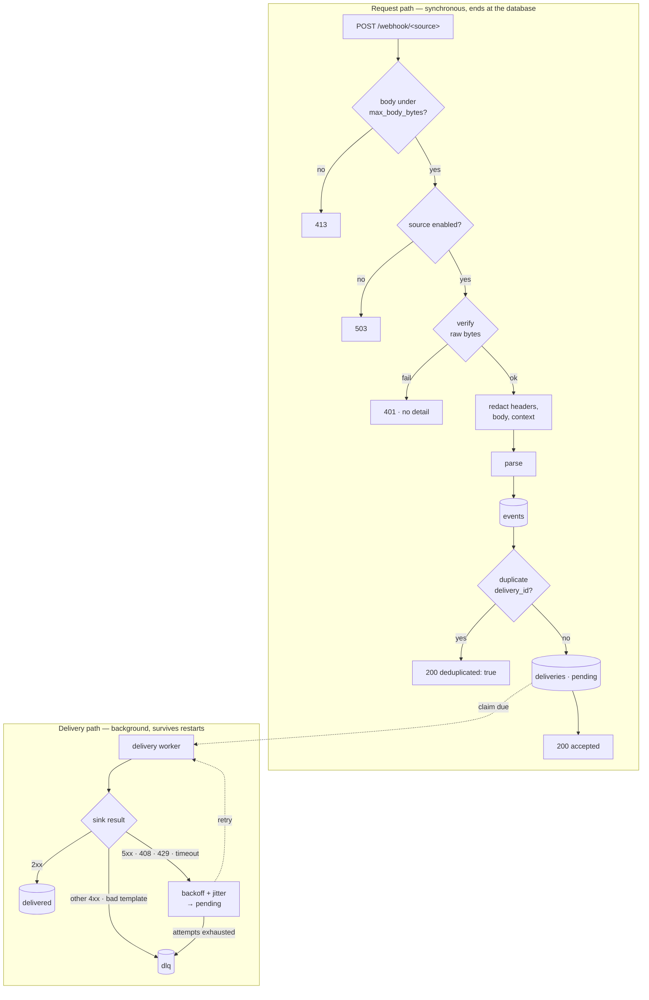

# Architecture

How webhook-doorman is put together, which decisions were deliberate, and where to extend it.

---

## The one-sentence version

A request is verified against its source's declared strategy, redacted, written to SQLite, and
answered — and a background worker delivers it to the configured sinks with retry and a
dead-letter queue.



---

## Decisions

### Verify before anything else, over the raw bytes

Verification runs on the body exactly as received, before JSON decoding, and every comparison is
`hmac.compare_digest`. A signature checked against a re-serialised payload is not a signature —
`json.dumps` normalises whitespace and key order, and an implementation that tolerates that has
accepted a class of forgery for free.

**An unset secret disables the source and rejects.** This is the whole reason the project exists.
The service it replaces contained:

```python
if not PLANE_WEBHOOK_SECRET:
    return True  # no secret configured, skip verification
```

on a `0.0.0.0` bind. Nothing about the running process looked wrong. So there are only two
states here — enabled, or rejecting — and `/health` names which sources are in the second one
and why.

### The request handler's job ends at the database

Persist, answer 2xx, stop. Dispatch is the worker's.

The alternative — fan out synchronously and answer once the sinks have — makes the producer's
view of your reliability depend on your slowest destination. GitHub allows ten seconds before it
marks a delivery failed. It also turns "the chat server is restarting" into a lost event rather
than a delayed one.

### SQLite, not Postgres

Routing is stateless. The database earns its place on exactly three things the listeners this
replaces could not do:

| Need | Without a database | With one |
|---|---|---|
| A sink is down | Event silently dropped | Persisted, retried, DLQ'd if exhausted |
| "Did that actually get delivered?" | Unanswerable | Event log + replay |
| Producer retries a delivery | Doubled message | Dedup on `(source, delivery_id)` |

Postgres is justified by multi-writer concurrency or replication. Neither applies at single-digit
events per minute, and it costs every adopter a second container and a new thing to back up.
Redis buys nothing either: the retry queue is a table and an asyncio worker, and rate limiting
belongs at the reverse proxy.

**Revisit trigger:** more than one router replica — at which point you need a shared queue and
locks, not a bigger file — or sustained load past what a single writer absorbs.

WAL mode with `synchronous=NORMAL`. Committed transactions survive a process crash; a small
window remains for power loss. That is the right trade here because the producer retries
whatever we did not acknowledge, so the failure mode is a duplicate that dedup absorbs.

### Redaction at write time, not encryption at rest

The event log is the one genuinely new risk this design introduces. It keeps every request on a
mounted volume — one an operator will back up and never think of as sensitive.

Redaction happens **once, at the ingest boundary**, and everything downstream (`payload`,
`summary`, `context`, the dedup id) is derived from the redacted bytes. Two passes: by header
name for things that are credentials by definition, and by value for every resolved secret,
matched as a substring anywhere.

Encryption at rest was considered and rejected. It moves the problem to key handling and tends to
end the way notify-proxy's did — a Fernet-encrypted column beside plaintext bot tokens, flagged
in its own README. Don't store the secret and there is nothing to encrypt.

The regression test for this reads the SQLite file **and its WAL sidecar** as raw bytes. An
earlier version passed a test that checked the redaction function was called, while the GitHub
parser was quietly writing the secret into `context_json`.

### Escaping belongs to the destination, not the data

Verification proves where a payload came from. It says nothing about whether the payload's
*content* is safe — an issue title on a public repo is written by a stranger and is authentically
signed by GitHub either way. So content that reaches a destination has to be escaped for the way
that destination renders it.

That is a property of the sink, which is why there are two template environments rather than one
global setting. `render()` leaves output alone: chat messages, push notifications and JSON
bodies, where HTML-escaping is corruption rather than hardening. `render_html()` escapes every
interpolated value, for destinations that render rich text — today, the Vikunja sink's
`description`.

The first version of this module had one environment with autoescape off, and a GitHub issue
body reached a Vikunja task description unescaped: stored XSS against whoever opened the task.
It was a recurrence — the service this replaced had the identical defect and fixed it with
`html.escape()` **in its parser**. Porting to templates dropped the fix silently, because a
parser is shared across sinks and cannot know how any of them render. Putting the decision back
where the rendering context is actually known is what stops it recurring a third time.

The Vikunja sink's `title` is deliberately *not* escaped: it is a plain-text field, and escaping
it would show a literal `&amp;` for the ordinary case of an ampersand in an issue title. Both
halves are asserted in `tests/test_sink_escaping.py`, so an over-broad "escape everything" fix
fails just as loudly as the original bug.

### No scripting engine

Templates are Jinja2 in a `SandboxedEnvironment`, text only. The comparable projects all took on
an interpreter — event-bridge uses RestrictedPython, WebhookX uses JS/wasm, NitroHook uses
sandboxed JS — and for most of them that is reasonable. It is not here: the entire value on offer
is fail-closed verification of untrusted inbound requests, and an in-process interpreter running
operator-authored code over attacker-supplied data undoes more than it adds.

---

## Exposure model

**The container always binds `0.0.0.0:8080`, and that is not configurable.**

The original design had a `HOST` variable that required a second explicit opt-in for `0.0.0.0`.
Inside a container that check is theatre: the app always binds all interfaces, and what can reach
the port is decided by the publish address and network membership. A guard that cannot fail reads
as a control while enforcing nothing, which is worse than its absence — someone will trust it.

So exposure is controlled where it actually lives:

| Goal | Mechanism |
|---|---|
| Host-side producers only | `-p 127.0.0.1:8080:8080` |
| Reverse proxy only | join the proxy's network, publish nothing |
| Public ingress | proxy with TLS and rate limiting; deny `/admin/` there |

The packaged entry point runs uvicorn with `proxy_headers=False`. That is load-bearing: an
unverified source's `allow_from` matches the **socket peer**, and enabling proxy headers would
let a caller set `X-Forwarded-For` and hand itself the allowlist.

### The `none` guard

`strategy: none` accepts on reachability alone, so it takes three things, all enforced at startup:

1. `server.allow_unverified: true` at the top level.
2. A per-source `unverified_reason` — non-blank, because the next person needs to know why.
3. A non-empty `allow_from` CIDR list. **There is no allow-all form.** An omitted or empty list
   is a startup error, not a wildcard.

Requiring the operator to type the CIDRs is deliberate. A default that silently produced
loopback-only would be safe but invisible; a startup failure makes the decision explicit.

---

## Module map

| Module | Owns | Never |
|---|---|---|
| `config.py` | Parsing and validating `config.yml` | Reads the environment or does I/O |
| `secrets.py` | Binding config to the environment; enabled/disabled state | Decides if a request is valid |
| `verification.py` | Deciding if a request is authentic | Imports FastAPI, logs, reads files |
| `redaction.py` | Removing credentials before storage or logs | Knows about sources or sinks |
| `parsers.py` | Vendor payload → template variables | Decides routing; raises on bad input |
| `app.py` | HTTP: routes, limits, status codes | Contains verification or persistence |
| `store/` | All SQL, behind the `Store` protocol | Knows about HTTP or sinks |
| `sinks/` | Delivery to one destination type | Knows which source produced an event |
| `engine.py` | Persist-then-dispatch, retry, DLQ, sweeps | Contains SQL or verification |

**No sink knows its source.** A sink that special-cases `if source == "github"` has let routing
leak into delivery, and the abstraction that makes this a router rather than four glued-together
listeners has stopped being real.

---

## Extension points

### A new source

A `config.yml` entry. No code. If adding a producer requires editing Python, that is a gap in the
abstraction — fix the gap, not the symptom.

### A new verification strategy

A model in `config.py` added to the `VerifySpec` union, a function in `verification.py`, a branch
in `verify()`. The fallthrough at the end of `verify()` must stay `False`, so an unrecognised
strategy can never reach "accepted". Negative tests required for empty secret, missing header and
wrong credential.

### A new sink

A model added to the `SinkSpec` union, a class in `sinks/`, an entry in `_BUILDERS`. Raise
`PermanentSinkError` for failures a retry cannot fix, `SinkError` for ones it can — that
distinction is what keeps a 400 from burning five attempts and a 503 from being discarded.

Three things the base layer already handles, so a new sink does not have to:

- **Credentials are discovered, not registered.** Any field on the model whose name ends in
  `_env` is picked up by `sink_secret_env_names()`, which derives them from the model rather
  than from a list. Name a field `webhook_url_env` and it is automatically required at startup,
  reported at `/health`, and added to the redaction set — there is no second place to update.
  (Before 0.1.1 this was a hardcoded tuple of four names, so a sink with any other credential
  field reported `enabled: true` with its variable unset, and its value was never redacted.)
- **Header encoding is guarded.** `HttpSinkBase._send` turns a `UnicodeError` into a
  `PermanentSinkError`, so a non-ASCII header value fails to the DLQ on the first attempt rather
  than spending the whole retry budget on an error that cannot change. A sink that renders event
  content into a header should still encode it itself — see `_encoded_word` in
  `sinks/implementations.py` — because failing fast beats five failures, but delivering beats
  both.
- **`Retry-After` is honoured.** A retryable response carrying the header puts the advertised
  delay on the `SinkError`, and the engine schedules against it — clamped to
  `delivery.max_backoff_seconds`, and still jittered. A sink does not need to think about it.

### A different storage backend

`store/base.py` is the seam. Every SQL statement in the project is behind it, and the engine
talks only in its vocabulary — `record_event`, `enqueue_deliveries`, `claim_due_deliveries`,
`requeue_incomplete`, `sweep`. A Postgres or Redis/Valkey implementation is an additional class,
not an engine rewrite.

This is a **named seam, not a shipped feature**, and the distinction is deliberate. Building a
second backend before there is a workload that needs one produces an abstraction shaped by
guesses about the backend rather than by its constraints. The revisit trigger is the one above:
more than one replica, or load past a single writer.

---

## What is protected, and what is not

**Protected.** There is no code path where a missing or empty secret accepts a request. Every
credential comparison is constant-time. HMAC covers the raw bytes. Credentials are redacted
before storage and never appear in a log or a response. Verification failures tell the caller
nothing. The body is capped before it is buffered. `/admin/` requires a token of at least 32
characters and is disabled without one.

**Not protected.** TLS and rate limiting — that is the reverse proxy's job. The exposure decision
itself: what can reach the published port is the operator's network configuration. The secrecy of
your secrets — a leaked webhook secret lets an attacker forge signed requests, and that is
verification working as designed. And `strategy: none` used carelessly: it is guarded and it warns
loudly, but an operator who writes `allow_from: ["0.0.0.0/0"]` has made an informed choice.
