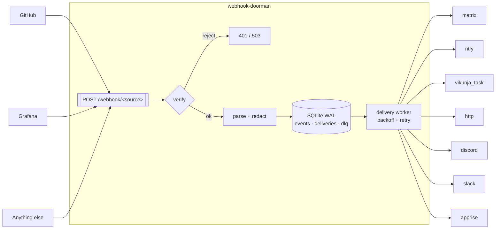

[](https://claude.ai/code)
[](https://github.com/TadMSTR/webhook-doorman/actions/workflows/ci.yml)
[](https://www.python.org/)
[](https://opensource.org/licenses/MIT)

# webhook-doorman

**A fail-closed inbound webhook router.** One ingress for every webhook you receive, with
per-source verification declared in YAML, durable delivery, and a dead-letter queue.

---

## The problem

Self-hosting a handful of services means receiving webhooks from a handful of vendors, and each
one signs differently — or, like Grafana, does not sign at all. The path of least resistance is a
small receiver per producer. Do that three times and you have three processes, three
verification designs, and no way to answer "did that delivery actually arrive?"

The failure mode is not hypothetical. This project was written to replace three such receivers,
one of which contained:

```python
def verify_signature(body: bytes, signature: str) -> bool:
    if not PLANE_WEBHOOK_SECRET:
        return True  # no secret configured, skip verification
```

That endpoint was bound to `0.0.0.0`. An unset environment variable turned signature
verification into an accept-anything endpoint, and nothing about the running service looked
wrong. **"Verification skipped" is the outcome that must never be reachable** — and it is what
this project is built to eliminate.

## What it does

- **Verifies every source, fail-closed.** HMAC-SHA256 (hex or base64, any header, any prefix),
  bearer token, HTTP Basic. An unset secret disables that source and rejects — it never falls
  through to accepted.
- **Config, not code.** Adding a source is a YAML entry. Secrets are referenced by environment
  variable *name*, never by value, so `config.yml` is safe to commit.
- **Never loses an event.** SQLite in WAL mode: dedup on `(source, delivery_id)`, retry with
  exponential backoff, a dead-letter queue when attempts are exhausted, and re-queue of anything
  in flight when the process restarts.
- **One container, one volume.** No Postgres, no Redis, no broker.

## Architecture



The request handler's job ends at the database. Dispatch belongs to the worker, so a slow sink
never holds a producer's connection open and a sink that is down does not turn into a lost event.

## Quickstart

```bash
curl -O https://raw.githubusercontent.com/TadMSTR/webhook-doorman/main/config.example.yml
cp config.example.yml config.yml && $EDITOR config.yml   # declare your sources and sinks
echo 'GITHUB_WEBHOOK_SECRET=...' > .env                  # secrets live here, never in YAML
docker run --rm -p 127.0.0.1:8080:8080 \
  -v "$PWD/config.yml:/config/config.yml:ro" -v doorman-data:/data \
  --env-file .env ghcr.io/tadmstr/webhook-doorman:0.1.1
```

`docker compose up -d` with the bundled `docker-compose.yml` does the same with hardened
defaults. `GET /health` reports which sources are live and which are disabled, and why — and
answers `503` when no source is enabled or the store is unreachable, so the container's health
status means something. See [Health](docs/deployment.md#health).

## Configuration

Sources, sinks, verification strategies and the guard rails on unverified sources are
documented in **[docs/configuration.md](docs/configuration.md)**. Worked configs are in
[`examples/`](examples/), all of which CI parses on every pull request.

```bash
webhook-doorman --config config.yml --check
```

## Security model

The exposure model, the verification guarantees and the content-safety layer for agent-facing
destinations are documented in **[docs/security.md](docs/security.md)**. To report a
vulnerability, see [SECURITY.md](SECURITY.md).

## Observability

Structured JSON logs to stdout have always been there. As of 0.3.0 there are numbers too.

### `GET /metrics`

Prometheus text format, no `prometheus_client` dependency. Unauthenticated by default — that is
the scrape convention, and requiring a token breaks a stock `scrape_config`. It exposes your
source and sink *names* and your traffic volume; it never exposes a payload, a header or a
secret. **Deny it at the reverse proxy, alongside `/admin/`.** Set `metrics.token_env` if you
want a bearer gate and can live with a non-standard scrape config.

| Metric | Type | Labels |
|---|---|---|
| `webhook_doorman_events_received_total` | counter | `source` |
| `webhook_doorman_events_deduplicated_total` | counter | `source` |
| `webhook_doorman_verification_failures_total` | counter | `source`, `strategy` |
| `webhook_doorman_requests_rejected_total` | counter | `source`, `reason` |
| `webhook_doorman_delivery_attempts_total` | counter | `sink`, `outcome` |
| `webhook_doorman_delivery_latency_seconds` | histogram | `sink` |
| `webhook_doorman_events_stored` | **gauge** | — |
| `webhook_doorman_deliveries` | **gauge** | `status` |
| `webhook_doorman_dlq_size` | **gauge** | — |
| `webhook_doorman_build_info` | gauge | `version` |

The gauges are point-in-time table counts and can go *down* when the retention sweep runs, which
is why none of them is named `_total`. The counters reset when the process restarts — correct
Prometheus semantics, and `process_start_time_seconds` is exported so a scraper can tell a reset
from a real drop.

`webhook_doorman_verification_failures_total` is the one to alert on. For a fail-closed router
the rejection rate is the security signal: a rise means something is probing an endpoint.

### `GET /admin/dlq`

Lists dead-lettered deliveries, newest first, behind the same bearer token as replay. This is
how you find the `event_id` to hand to `POST /admin/replay/{event_id}`.

```bash
curl -H "Authorization: Bearer $ADMIN_TOKEN" \
  'http://localhost:8080/admin/dlq?limit=20'
```

It returns failure metadata — `event_id`, `source`, `sink`, `attempt`, `response_code`, `error`,
`exhausted_at` — and **not the payload**. Pass the `next_before_id` from one page back as
`before_id` to get the next; that cursor is stable even while the retention sweep is deleting
rows underneath you.

### Tracing

Optional, off unless configured, and behind an extra:

```bash
pip install 'webhook-doorman[otel]'
export OTEL_EXPORTER_OTLP_ENDPOINT=http://collector:4318
export OTEL_SERVICE_NAME=webhook-doorman   # optional
```

The published Docker image already includes the extra, so there it is just the environment
variable. Setting the endpoint *without* the extra installed logs a warning at boot and the
router runs normally — telemetry is not worth taking a router down for. Spans carry only
config-derived and structural attributes; no payload content, headers or rendered template
output are ever exported.

Enabling tracing also enables OTel's automatic `httpx` instrumentation, which records the full
destination URL. For Discord and Slack that URL *is* the credential, so every resolved secret is
scrubbed from span attributes before export. Declare any credential-bearing URL through `*_env`
(`webhook_url_env`, `key_env`, `url_env`) rather than inline — an inline `url:` is not a resolved
secret and is redacted nowhere.

## Alternatives

The consumer-side projects worth knowing about, and where this one differs.

| Project | Stack | Verification | Persistence |
|---|---|---|---|
| **webhook-doorman** | Python, SQLite | **Per-source, declarative, fail-closed** | Event log, dedup, retry, DLQ, replay |
| [event-bridge](https://github.com/fangzhengmei/event-bridge) | Python, SQLite | None — its README says to do HMAC "at the application layer" | Persist, retry, DLQ, dashboard |
| [notify-proxy](https://github.com/muhkuh2005/notify-proxy) | Python, SQLite | Per-destination filters, not per-source verification | SQLAlchemy store |
| [adnanh/webhook](https://github.com/adnanh/webhook) | Go, stateless | Declarative trigger rules with HMAC | None — fire and forget |
| [WebhookHub](https://github.com/Paramoshka/WebhookHub) | — | — | Inspect, replay, forward |
| [WebhookX](https://github.com/webhookx-io/webhookx) | Go, Postgres + Redis | Multi-tenant, **license-gated** | Full |

The design borrows shapes from several of them — event-bridge's single-container SQLite
persist-retry-DLQ, `adnanh/webhook`'s declarative hook definitions, WebhookHub's replay. What
none of them offer is the thing this exists for: every one either treats the ingest endpoint as
unauthenticated by design or ties verification to a specific vendor.

Sending webhooks rather than receiving them is a different problem — use
[Convoy](https://getconvoy.io/) or [Svix](https://www.svix.com/).

## Non-goals

- **Outbound webhook delivery.** This is a consumer-side router. If you need to *send* webhooks
  with delivery guarantees to your own users, use [Convoy](https://getconvoy.io/) or
  [Svix](https://www.svix.com/).
- **A scripting engine.** Templates are Jinja2 in a sandboxed, text-only environment. For a
  service whose entire value is fail-closed verification, an in-process script sandbox is the
  wrong attack surface to take on.
- **Multi-tenancy.** One operator, one config file.

## Documentation

Full index: **[docs/index.md](docs/index.md)**.

| Document | Contents |
|---|---|
| [docs/configuration.md](docs/configuration.md) | Sources, sinks, verification strategies, guard rails on unverified sources |
| [docs/deployment.md](docs/deployment.md) | Exposure, file-permission traps, reverse proxy, migrating from an existing receiver |
| [docs/security.md](docs/security.md) | Exposure model, verification guarantees, the content-safety layer |
| [ARCHITECTURE.md](ARCHITECTURE.md) | Design decisions, extension points, what is protected and what is not |
| [SECURITY.md](SECURITY.md) | Reporting a vulnerability, threat model boundaries |
| [CONTRIBUTING.md](CONTRIBUTING.md) | Adding a source, sink or strategy; code style; tests |
| [examples/](examples/) | Worked configs, all parsed by CI on every pull request |
| [docs/verification-enforcement.mmd](docs/verification-enforcement.mmd) | Every path from a request to admitted or refused |
| [docs/delivery-lifecycle.mmd](docs/delivery-lifecycle.mmd) | Delivery states, retry, DLQ, crash recovery |

## License

MIT — see [LICENSE](LICENSE).
