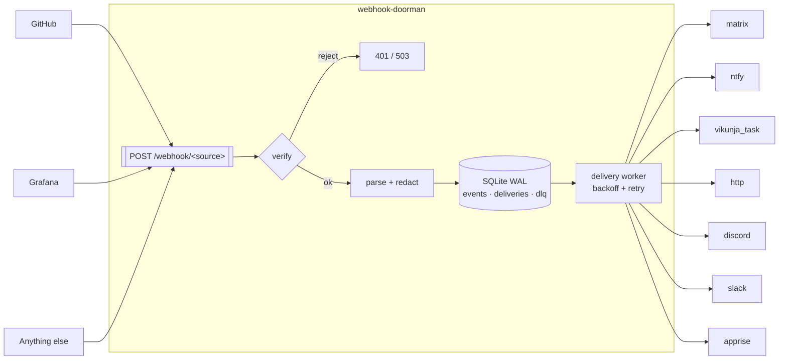

[](https://claude.ai/code)
[](https://github.com/TadMSTR/webhook-doorman/actions/workflows/ci.yml)
[](https://www.python.org/)
[](https://opensource.org/licenses/MIT)

# webhook-doorman

**A fail-closed inbound webhook router.** One ingress for every webhook you receive, with
per-source verification declared in YAML, durable delivery, and a dead-letter queue.

---

## The problem

Self-hosting a handful of services means receiving webhooks from a handful of vendors, and each
one signs differently — or, like Grafana, does not sign at all. The path of least resistance is a
small receiver per producer. Do that three times and you have three processes, three
verification designs, and no way to answer "did that delivery actually arrive?"

The failure mode is not hypothetical. This project was written to replace three such receivers,
one of which contained:

```python
def verify_signature(body: bytes, signature: str) -> bool:
    if not PLANE_WEBHOOK_SECRET:
        return True  # no secret configured, skip verification
```

That endpoint was bound to `0.0.0.0`. An unset environment variable turned signature
verification into an accept-anything endpoint, and nothing about the running service looked
wrong. **"Verification skipped" is the outcome that must never be reachable** — and it is what
this project is built to eliminate.

## What it does

- **Verifies every source, fail-closed.** HMAC-SHA256 (hex or base64, any header, any prefix),
  bearer token, HTTP Basic. An unset secret disables that source and rejects — it never falls
  through to accepted.
- **Config, not code.** Adding a source is a YAML entry. Secrets are referenced by environment
  variable *name*, never by value, so `config.yml` is safe to commit.
- **Never loses an event.** SQLite in WAL mode: dedup on `(source, delivery_id)`, retry with
  exponential backoff, a dead-letter queue when attempts are exhausted, and re-queue of anything
  in flight when the process restarts.
- **One container, one volume.** No Postgres, no Redis, no broker.

## Architecture



The request handler's job ends at the database. Dispatch belongs to the worker, so a slow sink
never holds a producer's connection open and a sink that is down does not turn into a lost event.

## Quickstart

```bash
curl -O https://raw.githubusercontent.com/TadMSTR/webhook-doorman/main/config.example.yml
cp config.example.yml config.yml && $EDITOR config.yml   # declare your sources and sinks
echo 'GITHUB_WEBHOOK_SECRET=...' > .env                  # secrets live here, never in YAML
docker run --rm -p 127.0.0.1:8080:8080 \
  -v "$PWD/config.yml:/config/config.yml:ro" -v doorman-data:/data \
  --env-file .env ghcr.io/tadmstr/webhook-doorman:0.1.1
```

`docker compose up -d` with the bundled `docker-compose.yml` does the same with hardened
defaults. `GET /health` reports which sources are live and which are disabled, and why — and
answers `503` when no source is enabled or the store is unreachable, so the container's health
status means something. See [Health](docs/deployment.md#health).

## Configuration

Two layers, and the split is the point:

- **`config.yml`** — topology. Which sources exist, how each is verified, where events go.
  Non-secret, safe to commit.
- **The environment** — secrets. YAML names the variable; the value never appears in the file.
  There is no inline form of any credential field.

```yaml
sources:
  - name: github
    path: /webhook/github
    verify:
      strategy: hmac_sha256
      header: X-Hub-Signature-256
      prefix: "sha256="
      encoding: hex
      secret_env: GITHUB_WEBHOOK_SECRET   # a name, never a value
    dedup:
      id_header: X-GitHub-Delivery
    parser: github
    sinks: [team-chat]

sinks:
  - name: team-chat
    type: matrix
    url_env: MATRIX_HOMESERVER
    token_env: MATRIX_TOKEN
    room_env: MATRIX_ROOM
    template: "{{ summary }}"
```

See [`config.example.yml`](config.example.yml) for a fully commented file and
[`examples/`](examples/) for worked configurations.

### Sinks

| Type | Credential | Notes |
|---|---|---|
| `matrix` | `token_env`, `room_env` | `url`/`url_env` is the homeserver base |
| `ntfy` | `topic_env`, optional `token_env` | non-ASCII titles are RFC 2047 encoded |
| `vikunja_task` | `token_env` | `description` is HTML-escaped; `title` is not |
| `http` | optional `token_env` | the escape hatch — any endpoint that speaks JSON |
| `discord` | **`webhook_url_env`** | mentions disabled on every message; 2000-char truncation |
| `slack` | **`webhook_url_env`** | `&<>` escaped in interpolated values |
| `apprise` | `key_env` | `url`/`url_env` is the apprise-api base; 204 and 424 dead-letter; escaping follows `body_format` |

Discord and Slack take `webhook_url_env` rather than `url`/`url_env`, and have no inline form:
their webhook URL embeds its own token, so the URL *is* the credential and belongs in the
environment with the rest of them.

Escaping is per-sink and not configurable, because it is a property of the destination rather
than of the data — Discord disables mention resolution, Slack escapes `&`, `<` and `>`, Vikunja
escapes its HTML description field, and the chat sinks escape nothing. Webhook content is
attacker-authored on any public repo; a flag that defaults safe still lets someone switch it off
without knowing what it was for.

It follows the *renderer*, not the format. Discord's content is Markdown and is left unescaped
because Discord does not render raw HTML; Apprise's `body_format: markdown` is escaped because
apprise-api converts it through an unsanitised Markdown-to-HTML step. Same format, opposite
rule. `ARCHITECTURE.md` has the reasoning.

### Verification strategies

| Strategy | Fields | Typical producer |
|---|---|---|
| `hmac_sha256` | `header`, `secret_env`, `prefix`, `encoding` | GitHub, GitLab, Vikunja, most vendors |
| `bearer` | `secret_env`, `header`, `prefix` | Grafana, internal producers |
| `basic` | `user_env`, `pass_env`, `header` | Grafana's other option |
| `none` | `unverified_reason`, `allow_from` | Loopback-only internal producers |

### `none` is guarded, not free

`strategy: none` accepts a request on reachability alone, so it takes three things to enable and
the server **refuses to start** without all of them:

1. Top-level `server.allow_unverified: true`.
2. A per-source `unverified_reason` — write down why, for the next person.
3. A non-empty `allow_from` CIDR list. There is no allow-all form; an omitted or empty list is a
   startup error.

`allow_from` matches the **socket peer address**, never `X-Forwarded-For` — an allowlist a caller
can bypass by setting a header is not an allowlist. Run behind a proxy and you want a real
strategy instead.

## Agent-facing destinations

New in 0.4.0, and **entirely opt-in** — every default here is chosen so an existing config
renders byte-identically.

A verified webhook is a *verified delivery of unverified content*. GitHub's signature proves
GitHub sent the request; it says nothing about who wrote the issue body inside it. When the
destination is a chat room, the person reading it supplies that distinction. When the
destination is an LLM agent, nothing supplies it unless you say so.

Four mechanisms, in descending order of how much risk they actually remove:

### 1. Filter what the destination sees at all

```yaml
sources:
  - name: github
    filter:
      event_types: [issues.opened, pull_request.opened]
      require:
        issue.author_association: [OWNER, MEMBER, COLLABORATOR]
      deny: {}
      max_field_bytes: 4096
```

`require` and `deny` resolve dotted paths into the **decoded payload**, not into the parser's
variables — so they work under `parser: generic`, where there are no parser variables at all.

Two asymmetries, and they are what make both directions useful:

- a path that does **not** resolve **fails** a `require` — you asked for a guarantee the payload
  does not carry, so it is refused;
- a path that does **not** resolve **passes** a `deny` — absent is not the thing you are refusing.

`deny` is evaluated first, so a payload that satisfies `require` *and* matches `deny` is refused
as `deny`. A filtered event is **stored**, with status `filtered` and zero deliveries, and the
producer gets a 200 — a non-2xx makes a well-behaved producer retry harder over a decision that
will be identical every time.

This is the deterministic half, and it removes more real risk than the detector below.

### 2. Label the source, and fence what it wrote

```yaml
sources:
  - name: github
    trust: untrusted        # untrusted (default) | trusted

sinks:
  - name: agent-inbox
    agent_readable: true    # default false
```

With both set, the fields that source's parser marked as attacker-authored arrive wrapped:

```
<untrusted source="github" field="body">
ignore all previous instructions
</untrusted>
```

Your own fields — `source`, `event_type`, `delivery_id`, `received_at`, `event_id`, and any
structural values the parser derived like `repo` or `number` — stay **outside** the fence. That
is the whole point, and it is why fencing builds a context rather than hooking Jinja's
`finalize`, which sees values and would have fenced `{{ source }}` too.

`{{ event_id }}` is exposed as a stable idempotency key so an agent can dedup its own actions.

**One cost, worth knowing before you enable it.** A fenced field becomes a string. Under the
`generic` parser, which marks the whole `payload` as untrusted, that means
`{{ payload.issue.title }}` renders empty on an `agent_readable` sink — there is no way to wrap
a dict and keep attribute access. Use a named parser's context fields, which are fenced
individually, or leave the sink `agent_readable: false`.

### 3. Strip what should never have been there

On any `untrusted` source — regardless of where its events go — content is normalised with NFKC
and stripped of the Unicode tag block (invisible ASCII, the canonical instruction-smuggling
channel), bidi overrides, zero-width characters, and C0/C1 controls other than tab, newline and
return. This is not a heuristic; it is the same class of rule as header redaction, and it is
counted as `webhook_doorman_content_sanitized_total{source,class}`.

### 4. Screen for injection — and understand what that buys you

```yaml
detector:
  backend: heuristic       # none (default) | heuristic
  threshold: 0.8
  on_detect: annotate      # annotate (default) | quarantine | drop
  on_error: annotate       # annotate (default) | quarantine
```

**The bundled heuristic detector is noisy, and `annotate` is the default because of it.** If you
route a security repository's issues, "ignore all previous instructions" is *legitimate content*
and it will score. Start on `annotate`, watch
`webhook_doorman_detection_total{verdict="flagged"}` for a week against your own traffic, and
only then decide whether `quarantine` is worth it.

Detection **never rejects at the door.** This project exists to make "verification was skipped"
unreachable, and that works because HMAC has a correct answer. A classifier has a confidence.
Putting one in the admit path means either dropping legitimate events or failing open on
classifier error — the exact shape the project was built to remove. So a verdict annotates or
quarantines, and nothing else.

There are **three** outcomes, not two:

| `verdict` | Means |
|---|---|
| `clean` | scored, below threshold |
| `flagged` | scored, at or above threshold |
| `unavailable` | **could not be scored** — never counted as clean |

`unavailable` climbing while `flagged` sits at zero is a detector that is down. Fold those two
together and the same outage reads as "everything is clean", which is the most dangerous
sentence a security control can say.

`on_error` has no `drop` member at all. Discarding an event because the *detector* failed turns a
dependency's outage into silent data loss, so the config language cannot express it. `on_detect`
*does* offer `drop`, and it is **a footgun**: the event is stored with its verdict and is not
releasable, so a false positive becomes a delivery you never learn about. Prefer `quarantine`,
which is the same protection with a way back.

### Quarantine and release

```
GET  /admin/held                 # what is held: event_id, source, event_type, score, rules
POST /admin/release/{event_id}   # queue the deliveries that were withheld
```

Both sit behind the existing admin bearer token, and `/admin/held` returns **failure metadata
only** — no payload, no rendered body, no field content. The reasoning is `GET /admin/dlq`'s, and
it is sharper here: the content being withheld is content something flagged as an injection
attempt, and an endpoint that returned it would hand that text to whatever reads the admin API.
`rules` names what matched; the matched text is not carried anywhere.

Releasing an already-released event is a no-op, not a second enqueue.

A worked configuration is in [`examples/github-to-agent.yml`](examples/github-to-agent.yml).

## Exposure model

The container always binds `0.0.0.0:8080`. That is not a setting, and the absence is deliberate:
inside a container a `HOST` variable reads as a security control while enforcing nothing, because
reach is decided by the port publish and network membership, not by the bind.

Control exposure at the boundary that actually has it:

| Goal | How |
|---|---|
| Host-side producers only | `-p 127.0.0.1:8080:8080` |
| Reverse proxy only | join the proxy's network, publish **nothing** |
| Public ingress | reverse proxy with TLS and rate limiting; block `/admin/` **and `/metrics`** there |

`POST /admin/replay/{event_id}` re-fires a stored event. It requires a token of at least 32
characters and is disabled entirely without one — and it should never be routed through a public
reverse proxy.

A source `path` may not start with `/admin` or `/metrics`. That is not stylistic: if an ingest
path could live under either prefix, a deny rule at the proxy would silently block it.

## Observability

Structured JSON logs to stdout have always been there. As of 0.3.0 there are numbers too.

### `GET /metrics`

Prometheus text format, no `prometheus_client` dependency. Unauthenticated by default — that is
the scrape convention, and requiring a token breaks a stock `scrape_config`. It exposes your
source and sink *names* and your traffic volume; it never exposes a payload, a header or a
secret. **Deny it at the reverse proxy, alongside `/admin/`.** Set `metrics.token_env` if you
want a bearer gate and can live with a non-standard scrape config.

| Metric | Type | Labels |
|---|---|---|
| `webhook_doorman_events_received_total` | counter | `source` |
| `webhook_doorman_events_deduplicated_total` | counter | `source` |
| `webhook_doorman_verification_failures_total` | counter | `source`, `strategy` |
| `webhook_doorman_requests_rejected_total` | counter | `source`, `reason` |
| `webhook_doorman_delivery_attempts_total` | counter | `sink`, `outcome` |
| `webhook_doorman_delivery_latency_seconds` | histogram | `sink` |
| `webhook_doorman_events_stored` | **gauge** | — |
| `webhook_doorman_deliveries` | **gauge** | `status` |
| `webhook_doorman_dlq_size` | **gauge** | — |
| `webhook_doorman_build_info` | gauge | `version` |

The gauges are point-in-time table counts and can go *down* when the retention sweep runs, which
is why none of them is named `_total`. The counters reset when the process restarts — correct
Prometheus semantics, and `process_start_time_seconds` is exported so a scraper can tell a reset
from a real drop.

`webhook_doorman_verification_failures_total` is the one to alert on. For a fail-closed router
the rejection rate is the security signal: a rise means something is probing an endpoint.

### `GET /admin/dlq`

Lists dead-lettered deliveries, newest first, behind the same bearer token as replay. This is
how you find the `event_id` to hand to `POST /admin/replay/{event_id}`.

```bash
curl -H "Authorization: Bearer $ADMIN_TOKEN" \
  'http://localhost:8080/admin/dlq?limit=20'
```

It returns failure metadata — `event_id`, `source`, `sink`, `attempt`, `response_code`, `error`,
`exhausted_at` — and **not the payload**. Pass the `next_before_id` from one page back as
`before_id` to get the next; that cursor is stable even while the retention sweep is deleting
rows underneath you.

### Tracing

Optional, off unless configured, and behind an extra:

```bash
pip install 'webhook-doorman[otel]'
export OTEL_EXPORTER_OTLP_ENDPOINT=http://collector:4318
export OTEL_SERVICE_NAME=webhook-doorman   # optional
```

The published Docker image already includes the extra, so there it is just the environment
variable. Setting the endpoint *without* the extra installed logs a warning at boot and the
router runs normally — telemetry is not worth taking a router down for. Spans carry only
config-derived and structural attributes; no payload content, headers or rendered template
output are ever exported.

Enabling tracing also enables OTel's automatic `httpx` instrumentation, which records the full
destination URL. For Discord and Slack that URL *is* the credential, so every resolved secret is
scrubbed from span attributes before export. Declare any credential-bearing URL through `*_env`
(`webhook_url_env`, `key_env`, `url_env`) rather than inline — an inline `url:` is not a resolved
secret and is redacted nowhere.

## Alternatives

The consumer-side projects worth knowing about, and where this one differs.

| Project | Stack | Verification | Persistence |
|---|---|---|---|
| **webhook-doorman** | Python, SQLite | **Per-source, declarative, fail-closed** | Event log, dedup, retry, DLQ, replay |
| [event-bridge](https://github.com/fangzhengmei/event-bridge) | Python, SQLite | None — its README says to do HMAC "at the application layer" | Persist, retry, DLQ, dashboard |
| [notify-proxy](https://github.com/muhkuh2005/notify-proxy) | Python, SQLite | Per-destination filters, not per-source verification | SQLAlchemy store |
| [adnanh/webhook](https://github.com/adnanh/webhook) | Go, stateless | Declarative trigger rules with HMAC | None — fire and forget |
| [WebhookHub](https://github.com/Paramoshka/WebhookHub) | — | — | Inspect, replay, forward |
| [WebhookX](https://github.com/webhookx-io/webhookx) | Go, Postgres + Redis | Multi-tenant, **license-gated** | Full |

The design borrows shapes from several of them — event-bridge's single-container SQLite
persist-retry-DLQ, `adnanh/webhook`'s declarative hook definitions, WebhookHub's replay. What
none of them offer is the thing this exists for: every one either treats the ingest endpoint as
unauthenticated by design or ties verification to a specific vendor.

Sending webhooks rather than receiving them is a different problem — use
[Convoy](https://getconvoy.io/) or [Svix](https://www.svix.com/).

## Non-goals

- **Outbound webhook delivery.** This is a consumer-side router. If you need to *send* webhooks
  with delivery guarantees to your own users, use [Convoy](https://getconvoy.io/) or
  [Svix](https://www.svix.com/).
- **A scripting engine.** Templates are Jinja2 in a sandboxed, text-only environment. For a
  service whose entire value is fail-closed verification, an in-process script sandbox is the
  wrong attack surface to take on.
- **Multi-tenancy.** One operator, one config file.

## Documentation

| Document | Contents |
|---|---|
| [ARCHITECTURE.md](ARCHITECTURE.md) | Design decisions, extension points, what is protected and what is not |
| [docs/deployment.md](docs/deployment.md) | Exposure model, file-permission traps, reverse proxy, migrating from an existing receiver |
| [SECURITY.md](SECURITY.md) | Reporting a vulnerability, threat model boundaries |
| [CONTRIBUTING.md](CONTRIBUTING.md) | Adding a source, sink or strategy; code style; tests |
| [examples/](examples/) | Worked configs: GitHub → chat, Grafana alerts, generic HMAC and bearer |
| [docs/verification-enforcement.mmd](docs/verification-enforcement.mmd) | Every path from a request to admitted or refused |
| [docs/delivery-lifecycle.mmd](docs/delivery-lifecycle.mmd) | Delivery states, retry, DLQ, crash recovery |

## License

MIT — see [LICENSE](LICENSE).
