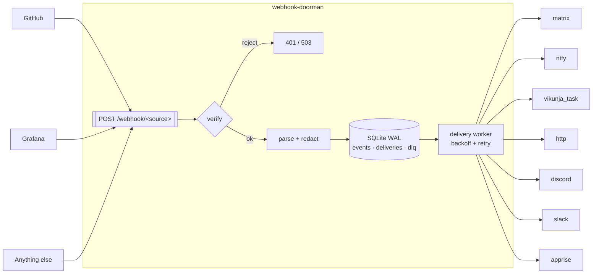

[](https://claude.ai/code)
[](https://github.com/TadMSTR/webhook-doorman/actions/workflows/ci.yml)
[](https://www.python.org/)
[](https://opensource.org/licenses/MIT)

# webhook-doorman

**A fail-closed inbound webhook router.** One ingress for every webhook you receive, with
per-source verification declared in YAML, durable delivery, and a dead-letter queue.

---

## The problem

Self-hosting a handful of services means receiving webhooks from a handful of vendors, and each
one signs differently — or, like Grafana, does not sign at all. The path of least resistance is a
small receiver per producer. Do that three times and you have three processes, three
verification designs, and no way to answer "did that delivery actually arrive?"

The failure mode is not hypothetical. This project was written to replace three such receivers,
one of which contained:

```python
def verify_signature(body: bytes, signature: str) -> bool:
    if not PLANE_WEBHOOK_SECRET:
        return True  # no secret configured, skip verification
```

That endpoint was bound to `0.0.0.0`. An unset environment variable turned signature
verification into an accept-anything endpoint, and nothing about the running service looked
wrong. **"Verification skipped" is the outcome that must never be reachable** — and it is what
this project is built to eliminate.

## What it does

- **Verifies every source, fail-closed.** HMAC-SHA256 (hex or base64, any header, any prefix),
  bearer token, HTTP Basic. An unset secret disables that source and rejects — it never falls
  through to accepted.
- **Config, not code.** Adding a source is a YAML entry. Secrets are referenced by environment
  variable *name*, never by value, so `config.yml` is safe to commit.
- **Never loses an event.** SQLite in WAL mode: dedup on `(source, delivery_id)`, retry with
  exponential backoff, a dead-letter queue when attempts are exhausted, and re-queue of anything
  in flight when the process restarts.
- **One container, one volume.** No Postgres, no Redis, no broker.

## Architecture



The request handler's job ends at the database. Dispatch belongs to the worker, so a slow sink
never holds a producer's connection open and a sink that is down does not turn into a lost event.

## Quickstart

```bash
curl -O https://raw.githubusercontent.com/TadMSTR/webhook-doorman/main/config.example.yml
cp config.example.yml config.yml && $EDITOR config.yml   # declare your sources and sinks
echo 'GITHUB_WEBHOOK_SECRET=...' > .env                  # secrets live here, never in YAML
docker run --rm -p 127.0.0.1:8080:8080 \
  -v "$PWD/config.yml:/config/config.yml:ro" -v doorman-data:/data \
  --env-file .env ghcr.io/tadmstr/webhook-doorman:0.1.1
```

`docker compose up -d` with the bundled `docker-compose.yml` does the same with hardened
defaults. `GET /health` reports which sources are live and which are disabled, and why — and
answers `503` when no source is enabled or the store is unreachable, so the container's health
status means something. See [Health](docs/deployment.md#health).

## Configuration

Two layers, and the split is the point:

- **`config.yml`** — topology. Which sources exist, how each is verified, where events go.
  Non-secret, safe to commit.
- **The environment** — secrets. YAML names the variable; the value never appears in the file.
  There is no inline form of any credential field.

```yaml
sources:
  - name: github
    path: /webhook/github
    verify:
      strategy: hmac_sha256
      header: X-Hub-Signature-256
      prefix: "sha256="
      encoding: hex
      secret_env: GITHUB_WEBHOOK_SECRET   # a name, never a value
    dedup:
      id_header: X-GitHub-Delivery
    parser: github
    sinks: [team-chat]

sinks:
  - name: team-chat
    type: matrix
    url_env: MATRIX_HOMESERVER
    token_env: MATRIX_TOKEN
    room_env: MATRIX_ROOM
    template: "{{ summary }}"
```

See [`config.example.yml`](config.example.yml) for a fully commented file and
[`examples/`](examples/) for worked configurations.

### Sinks

| Type | Credential | Notes |
|---|---|---|
| `matrix` | `token_env`, `room_env` | `url`/`url_env` is the homeserver base |
| `ntfy` | `topic_env`, optional `token_env` | non-ASCII titles are RFC 2047 encoded |
| `vikunja_task` | `token_env` | `description` is HTML-escaped; `title` is not |
| `http` | optional `token_env` | the escape hatch — any endpoint that speaks JSON |
| `discord` | **`webhook_url_env`** | mentions disabled on every message; 2000-char truncation |
| `slack` | **`webhook_url_env`** | `&<>` escaped in interpolated values |
| `apprise` | `key_env` | `url`/`url_env` is the apprise-api base; 204 and 424 dead-letter; escaping follows `body_format` |

Discord and Slack take `webhook_url_env` rather than `url`/`url_env`, and have no inline form:
their webhook URL embeds its own token, so the URL *is* the credential and belongs in the
environment with the rest of them.

Escaping is per-sink and not configurable, because it is a property of the destination rather
than of the data — Discord disables mention resolution, Slack escapes `&`, `<` and `>`, Vikunja
escapes its HTML description field, and the chat sinks escape nothing. Webhook content is
attacker-authored on any public repo; a flag that defaults safe still lets someone switch it off
without knowing what it was for.

It follows the *renderer*, not the format. Discord's content is Markdown and is left unescaped
because Discord does not render raw HTML; Apprise's `body_format: markdown` is escaped because
apprise-api converts it through an unsanitised Markdown-to-HTML step. Same format, opposite
rule. `ARCHITECTURE.md` has the reasoning.

### Verification strategies

| Strategy | Fields | Typical producer |
|---|---|---|
| `hmac_sha256` | `header`, `secret_env`, `prefix`, `encoding` | GitHub, GitLab, Vikunja, most vendors |
| `bearer` | `secret_env`, `header`, `prefix` | Grafana, internal producers |
| `basic` | `user_env`, `pass_env`, `header` | Grafana's other option |
| `none` | `unverified_reason`, `allow_from` | Loopback-only internal producers |

### `none` is guarded, not free

`strategy: none` accepts a request on reachability alone, so it takes three things to enable and
the server **refuses to start** without all of them:

1. Top-level `server.allow_unverified: true`.
2. A per-source `unverified_reason` — write down why, for the next person.
3. A non-empty `allow_from` CIDR list. There is no allow-all form; an omitted or empty list is a
   startup error.

`allow_from` matches the **socket peer address**, never `X-Forwarded-For` — an allowlist a caller
can bypass by setting a header is not an allowlist. Run behind a proxy and you want a real
strategy instead.

## Exposure model

The container always binds `0.0.0.0:8080`. That is not a setting, and the absence is deliberate:
inside a container a `HOST` variable reads as a security control while enforcing nothing, because
reach is decided by the port publish and network membership, not by the bind.

Control exposure at the boundary that actually has it:

| Goal | How |
|---|---|
| Host-side producers only | `-p 127.0.0.1:8080:8080` |
| Reverse proxy only | join the proxy's network, publish **nothing** |
| Public ingress | reverse proxy with TLS and rate limiting; block `/admin/` there |

`POST /admin/replay/{event_id}` re-fires a stored event. It requires a token of at least 32
characters and is disabled entirely without one — and it should never be routed through a public
reverse proxy.

## Alternatives

The consumer-side projects worth knowing about, and where this one differs.

| Project | Stack | Verification | Persistence |
|---|---|---|---|
| **webhook-doorman** | Python, SQLite | **Per-source, declarative, fail-closed** | Event log, dedup, retry, DLQ, replay |
| [event-bridge](https://github.com/fangzhengmei/event-bridge) | Python, SQLite | None — its README says to do HMAC "at the application layer" | Persist, retry, DLQ, dashboard |
| [notify-proxy](https://github.com/muhkuh2005/notify-proxy) | Python, SQLite | Per-destination filters, not per-source verification | SQLAlchemy store |
| [adnanh/webhook](https://github.com/adnanh/webhook) | Go, stateless | Declarative trigger rules with HMAC | None — fire and forget |
| [WebhookHub](https://github.com/Paramoshka/WebhookHub) | — | — | Inspect, replay, forward |
| [WebhookX](https://github.com/webhookx-io/webhookx) | Go, Postgres + Redis | Multi-tenant, **license-gated** | Full |

The design borrows shapes from several of them — event-bridge's single-container SQLite
persist-retry-DLQ, `adnanh/webhook`'s declarative hook definitions, WebhookHub's replay. What
none of them offer is the thing this exists for: every one either treats the ingest endpoint as
unauthenticated by design or ties verification to a specific vendor.

Sending webhooks rather than receiving them is a different problem — use
[Convoy](https://getconvoy.io/) or [Svix](https://www.svix.com/).

## Non-goals

- **Outbound webhook delivery.** This is a consumer-side router. If you need to *send* webhooks
  with delivery guarantees to your own users, use [Convoy](https://getconvoy.io/) or
  [Svix](https://www.svix.com/).
- **A scripting engine.** Templates are Jinja2 in a sandboxed, text-only environment. For a
  service whose entire value is fail-closed verification, an in-process script sandbox is the
  wrong attack surface to take on.
- **Multi-tenancy.** One operator, one config file.

## Documentation

| Document | Contents |
|---|---|
| [ARCHITECTURE.md](ARCHITECTURE.md) | Design decisions, extension points, what is protected and what is not |
| [docs/deployment.md](docs/deployment.md) | Exposure model, file-permission traps, reverse proxy, migrating from an existing receiver |
| [SECURITY.md](SECURITY.md) | Reporting a vulnerability, threat model boundaries |
| [CONTRIBUTING.md](CONTRIBUTING.md) | Adding a source, sink or strategy; code style; tests |
| [examples/](examples/) | Worked configs: GitHub → chat, Grafana alerts, generic HMAC and bearer |
| [docs/verification-enforcement.mmd](docs/verification-enforcement.mmd) | Every path from a request to admitted or refused |
| [docs/delivery-lifecycle.mmd](docs/delivery-lifecycle.mmd) | Delivery states, retry, DLQ, crash recovery |

## License

MIT — see [LICENSE](LICENSE).
