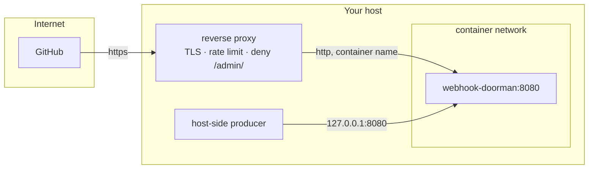

# Deployment

Everything here is about the boundary between the container and the things around it. The
in-process design is in [ARCHITECTURE.md](../ARCHITECTURE.md).

---

## Exposure

**The container always binds `0.0.0.0:8080`, and that is not a setting.** Reach is decided by the
port publish and network membership, not by the bind address, so a `HOST` variable would read as
a control while enforcing nothing.



| Goal | How |
|---|---|
| Host-side producers only | `ports: ["127.0.0.1:8080:8080"]` |
| Reverse proxy only | join the proxy's network; publish **nothing** |
| Both | do both — they are independent |

Publishing `8080:8080` with no address prefix exposes the router on every interface. That is
occasionally what you want and never what you want by accident.

---

## Two file-permission traps

Both come from the same place: the container runs as **UID 10001**, and the host does not.

### The data directory must be owned by 10001

```bash
mkdir -p /path/to/appdata/webhook-doorman/data
chown -R 10001:10001 /path/to/appdata/webhook-doorman/data
```

SQLite does not just create the database file — WAL mode writes `-wal` and `-shm` siblings
*beside* it, so the container needs write permission on the **directory**, not only the file.
Relying on Docker to auto-create the volume path gives you a root-owned directory and a service
that fails at boot.

Verify:

```bash
docker compose exec webhook-doorman ls -la /data
# -rw-r--r-- 1 10001 10001 ... webhook-doorman.db
# -rw-r--r-- 1 10001 10001 ... webhook-doorman.db-wal
# -rw-r--r-- 1 10001 10001 ... webhook-doorman.db-shm
```

### Pass `.env` with `env_file:`, not a bind mount

```yaml
env_file: .env          # correct
```

```yaml
volumes:
  - ./.env:/app/.env    # wrong, if .env is 0600
```

`env_file:` is read by the **Docker daemon, as root**, at container start. The file can stay
`0600` and owned by you while the container runs unprivileged. Bind-mount it instead and UID
10001 cannot open it — the service fails closed at boot with an error that reads like a bug.

The `config.yml` mount is fine as a bind mount: it holds no secrets and should be world-readable
(`0644`).

---

## Reverse proxy

Two prefixes should be unreachable from outside.

`/admin/` re-fires stored events at their real destinations (`/admin/replay/{event_id}`) and
lists the dead-letter queue (`/admin/dlq`). It requires a token.

`/metrics` is **unauthenticated by default** — that is the Prometheus scrape convention, and
requiring a token breaks a stock `scrape_config`. It exposes no payload, header or secret, but
it does expose your source and sink *names* and your traffic volume, which is topology. Deny it
at the edge and scrape it from inside the network. If you would rather gate it, set
`metrics.token_env`; note that a token shorter than 32 characters is treated as absent and
leaves the endpoint **open**, which is logged as `metrics_unauthenticated` at boot.

A source `path` may not start with `/admin` or `/metrics`, so neither deny rule below can
accidentally shadow an ingest path.

**nginx:**

```nginx
server {
    server_name hooks.example.com;
    client_max_body_size 1m;

    location /admin/ {
        return 404;          # 404, not 403 — do not confirm it exists
    }

    location /metrics {
        return 404;
    }

    location / {
        limit_req zone=webhooks burst=10 nodelay;
        proxy_pass http://webhook-doorman:8080;
    }
}
```

**Caddy:**

```caddy
hooks.example.com {
    handle /admin/* {
        respond 404
    }
    handle /metrics* {
        respond 404
    }
    handle {
        reverse_proxy webhook-doorman:8080
    }
}
```

Two things worth setting either way:

- **A body limit** at the proxy as well as in `config.yml`. The router's own cap rejects
  oversized bodies before buffering them, but stopping them a hop earlier is cheaper.
- **Rate limiting.** Deliberately not built in: the proxy already does it better, and doing it
  in-process would mean either shared state or a limit that multiplies by replica count.

Do **not** enable proxy header forwarding on the router itself. `allow_from` on an unverified
source matches the socket peer, and trusting `X-Forwarded-For` would hand a caller the allowlist.

---

## Migrating from an existing receiver

Cut over in this order. The failure mode of getting it wrong is webhooks that stop silently.

1. **Run in parallel first.** Publish the router on a spare loopback port and leave the old
   receiver serving real traffic. Nothing external points at the router yet.
2. **Keep the existing hostname.** Repoint the proxy at the container rather than renaming the
   endpoint. A rename touches producer configuration at GitHub, Grafana and everywhere else — do
   it separately, later, or not at all. Two moving parts in one change is how a webhook goes
   quiet for a week.
3. **Verify with a real producer event**, not a hand-rolled `curl`. A synthesised payload proves
   the parser works. It does not prove the producer can reach you, that its secret matches, or
   that the proxy forwards the signature header.
4. **Then** stop the old receiver.

`GET /health` after each step. It reports every source, whether it is enabled, and the reason if
not — a source silently disabled by a missing environment variable is the most likely way a
cutover looks fine and delivers nothing.

---

## Health

`GET /health` answers with a status code as well as a body, and the image's `HEALTHCHECK` polls
it, so the code is what decides whether the container is healthy.

| Condition | Code | `status` |
|---|---|---|
| Serving normally | `200` | `ok` |
| Some sources disabled, at least one enabled | `200` | `ok` |
| No source enabled at all | `503` | `degraded` |
| Store unreachable | `503` | `degraded` |

A partial degradation stays healthy on purpose. One disabled source out of several is usually
deliberate — a secret not provisioned yet, a producer retired in place — and turning that into an
unhealthy container would mean a restart loop over a state you chose. The disabled source is
named in `sources`, with the reason, either way; that is where you look, not at the status code.

When `status` is `degraded`, the `degraded` array names each reason. When an engine is attached,
a `stats` block carries event, delivery and DLQ counts; it is omitted rather than fatal if the
store cannot answer, and that omission is itself one of the degraded conditions.

---

## Operating

**Logs** are JSON on stdout. `LOG_LEVEL=DEBUG` for more. `LOG_FORMAT=console` switches to
human-readable output for local development — leave it unset in a container, where a parseable
stream is the point.

Every line emitted while handling a request carries `source`, and `delivery_id` once it is
known, so a rejection can be traced back to the request that caused it.

Events worth alerting on:

| Event | Meaning |
|---|---|
| `source_disabled` | A source has no secret. It is rejecting every request. |
| `source_unverified` | A `none` source is live. Logged at boot, every boot, on purpose. |
| `verification_failed` | Someone sent an unsigned or mis-signed request. |
| `delivery_exhausted` | A delivery gave up and went to the DLQ. |
| `deliveries_requeued` | Recovery after an unclean shutdown. Expected after a restart. |
| `health_stats_failed` | `/health` could not read the store. The container is reporting 503. |
| `metrics_unauthenticated` | `metrics.token_env` is set but the value is missing or too short. **`/metrics` is serving without a token.** |
| `tracing_unavailable` | `OTEL_EXPORTER_OTLP_ENDPOINT` is set but the `[otel]` extra is not installed. No spans are being exported. |

---

## Metrics

`GET /metrics` serves the Prometheus text exposition format. See the Reverse proxy section above
for why it should be denied at the edge and scraped from inside the network.

```yaml
scrape_configs:
  - job_name: webhook-doorman
    static_configs:
      - targets: ["webhook-doorman:8080"]
```

Two things to know before writing a query against it:

- **The gauges are point-in-time**, not cumulative. `webhook_doorman_events_stored`,
  `webhook_doorman_deliveries` and `webhook_doorman_dlq_size` are `COUNT(*)` at scrape time and
  go *down* when the retention sweep runs. None of them is named `_total`, and none should be
  wrapped in `rate()`.
- **The counters reset when the process restarts.** That is correct Prometheus semantics —
  `rate()` and `increase()` handle it — and `process_start_time_seconds` tells you when it
  happened, so a restart is distinguishable from a genuine drop to zero.

The metric worth alerting on is `webhook_doorman_verification_failures_total`. For a fail-closed
router the rejection rate is the security signal, not a curiosity:

```promql
sum by (source) (rate(webhook_doorman_verification_failures_total[5m])) > 0.1
```

`webhook_doorman_delivery_attempts_total{outcome="exhausted"}` rising means events are reaching
the DLQ; `/admin/dlq` is where you find out which.

A scrape runs `COUNT(*)` over three tables. That is nothing at this volume — note it if you ever
run this at a hundred times the traffic. If the store cannot be read, the scrape degrades to
counters-only rather than failing: a 500 here would tell the scraper the target is down, which
is less true than the gauges being briefly absent.

---

## Tracing

Optional and off unless configured. Install the extra and set an endpoint:

```yaml
environment:
  OTEL_EXPORTER_OTLP_ENDPOINT: http://signoz-otel-collector:4318
  OTEL_SERVICE_NAME: webhook-doorman
```

The published image already includes `[otel]`, so on Docker this is the whole configuration. On
a pip install, `pip install 'webhook-doorman[otel]'` first — setting the endpoint without the
extra logs `tracing_unavailable` at boot and the router serves traffic normally.

One span per ingest and one per delivery attempt. They are **not** parent and child: a retry
runs in the background worker minutes after the request has finished, so the delivery span is a
root and `delivery_id` is the correlation key across both.

**Sink credentials are scrubbed from client spans.** Enabling tracing also enables OTel's
automatic `httpx` instrumentation, which records the full destination URL on every client span.
For Discord and Slack the webhook URL *is* the credential, and for Apprise it is the `key` path
segment — so without scrubbing, turning on tracing would export those to your collector on every
delivery attempt. Every resolved secret is stripped from span attributes before export, matching
by value rather than by attribute name so the guard survives OTel's in-progress `http.url` →
`url.full` rename. Non-secret parts of the URL are left readable: an Apprise span still shows the
base URL and `/notify/`, with only the key replaced.

This depends on the credential being in a `*_env` field, which is how every bundled sink declares
one. A `type: http` sink with an authenticated URL written **inline** as `url:` is not a resolved
secret, is not redacted anywhere else either, and would be exported — use `url_env` for any URL
that carries a credential.

**Do not add `--workers` to the entry point.** The SDK is configured in-process, and its
`BatchSpanProcessor` thread does not survive a fork — adding workers would silently stop
exporting spans from the children, with no error and no log line. SQLite has a single writer
anyway, so more workers is not the scaling lever it looks like.

---

**Backups.** The database holds the event log — no credentials, by design, and there is a test
asserting exactly that against the raw file. Back up `/data` if you want the replay history;
losing it costs you the log and any deliveries still in backoff, not your configuration.

To copy it safely while running, use `sqlite3 /data/webhook-doorman.db ".backup /tmp/out.db"`
rather than `cp` — a plain copy of a WAL-mode database can catch it mid-transaction.

**Upgrades** are a pull and a recreate. The schema migrates forward on startup.
